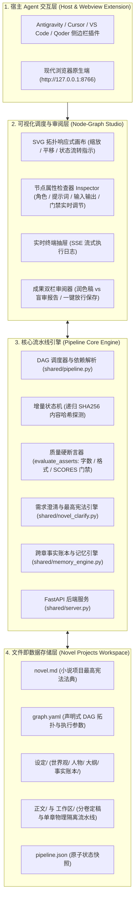
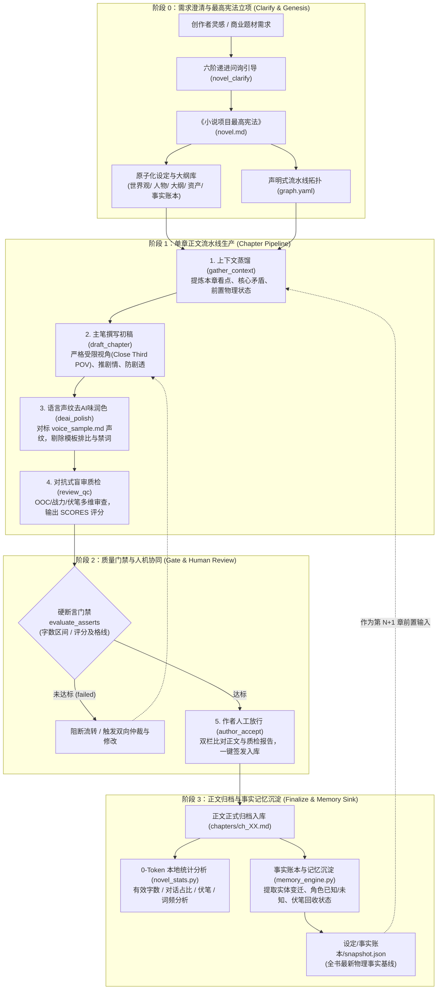
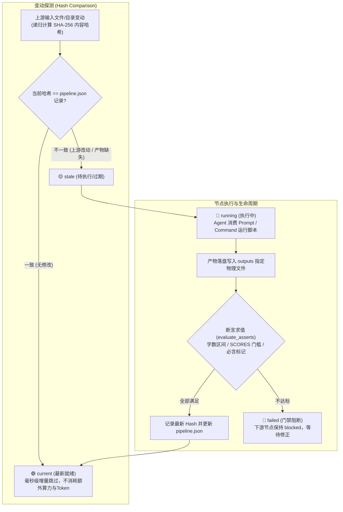
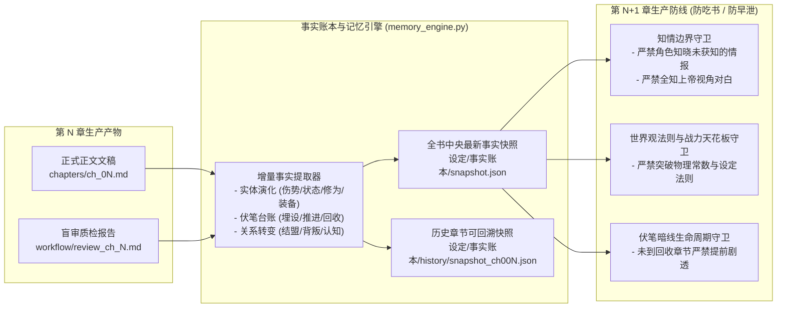
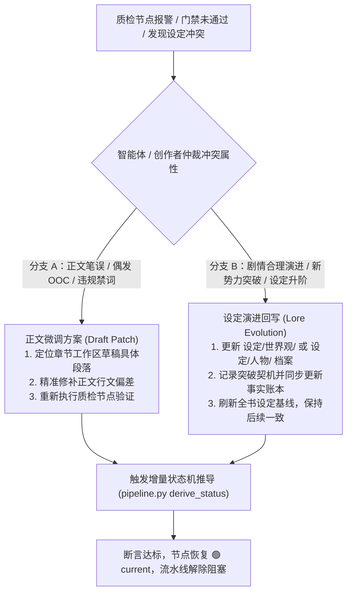

# 笔心 Studio (Novel Pipeline Studio)

> **工业化小说生产系统** —— 一套面向长篇连载与深度故事创作的**轻量、开源、完全可自定义、由桌面宿主 AI Agent（如 Antigravity / Cursor / Qoder 等）免密直驱**的可视化小说生产工作流平台。

[](https://www.python.org/)
[](LICENSE)
[](https://fastapi.tiangolo.com/)
[](#三-运行依赖与环境准备)
[](#四-核心重要概念)

---

## 📖 目录

- [一、 项目背景与解决痛点](#一-项目背景与解决痛点)
- [二、 系统架构与核心机制全景](#二-系统架构与核心机制全景)
  - [2.1 分层架构图](#21-分层架构图)
  - [2.2 核心运行机制图解 (Core Mechanisms)](#22-核心运行机制图解-core-mechanisms)
    - [2.2.1 长篇小说工业化生产闭环机制](#221-长篇小说工业化生产闭环机制)
    - [2.2.2 增量 SHA-256 递归状态机流转机制](#222-增量-sha-256-递归状态机流转机制)
    - [2.2.3 跨章事实账本与知情边界守卫机制](#223-跨章事实账本与知情边界守卫机制)
    - [2.2.4 吃书冲突排查与双向仲裁决策机制](#224-吃书冲突排查与双向仲裁决策机制)
  - [2.3 仓库目录结构详解](#23-仓库目录结构详解)
- [三、 运行依赖与环境准备](#三-运行依赖与环境准备)
  - [3.1 运行时环境](#31-运行时环境)
  - [3.2 依赖安装](#32-依赖安装)
- [四、 核心重要概念](#四-核心重要概念)
  - [4.1 三阶异构节点模型 (Heterogeneous Nodes)](#41-三阶异构节点模型-heterogeneous-nodes)
  - [4.2 文件即接口与上下文物理隔离 (File-as-Interface)](#42-文件即接口与上下文物理隔离-file-as-interface)
  - [4.3 增量 SHA256 递归内容状态机](#43-增量-sha256-递归内容状态机)
  - [4.4 质量硬断言门禁 (Asserts Enforcement)](#44-质量硬断言门禁-asserts-enforcement)
  - [4.5 模板变量与参数化展开](#45-模板变量与参数化展开)
- [五、 项目启动与常用命令](#五-项目启动与常用命令)
  - [5.1 启动 Studio 可视化服务](#51-启动-studio-可视化服务)
  - [5.2 运行自动化单元测试](#52-运行自动化单元测试)
  - [5.3 命令行状态检查与调度](#53-命令行状态检查与调度)
- [六、 创作工作流使用指南](#六-创作工作流使用指南)
  - [步骤 1：初始化小说项目](#步骤-1初始化小说项目)
  - [步骤 2：完善设定与大纲](#步骤-2完善设定与大纲)
  - [步骤 3：宿主 Agent (Antigravity) 协同驱动创作](#步骤-3宿主-agent-antigravity-协同驱动创作)
  - [步骤 4：在 WebUI 画布中审阅与人工放行](#步骤-4在-webui-画布中审阅与人工放行)
- [七、 系统灵活扩展点](#七-系统灵活扩展点)
- [八、 下一步演化方向 (Roadmap)](#八-下一步演化方向-roadmap)

---

## 一、 项目背景与解决痛点

在使用大语言模型进行长篇连载创作时，传统“单会话对话框”模式往往会遇到一系列致命瓶颈：
1. **设定吃书 (Lore Inconsistency)**：随着聊天历史变长，模型遗忘前期设定的世界观法则、战力等级与关键约束；
2. **角色性格崩坏 (OOC / Out of Character)**：主角与配角语气同质化，缺乏性格指纹和长期行为逻辑约束；
3. **严重 AI 味泛滥**：机械排比句、空洞升华、陈词滥调、说教式抒情充斥，缺乏真实小说质感；
4. **Token 爆炸与注意涣散**：将整本小说数十万字全部硬塞入上下文，导致大模型注意力漂移且单次调用成本极高；
5. **对外部独立网关与 API Key 的强依赖**：许多开源写作工作流需要配置复杂的外部网关、代理服务或第三方 Key。

**笔心 Studio 的解决方案：**
- **宿主 Agent 免密直驱**：直接由当前运行的开发环境宿主 Agent（如 Antigravity、Cursor）充当智慧中枢，不需要重复配置外部 Key；
- **文件即接口 (File-as-Interface)**：严禁共享混乱聊天记录，每个节点只读指定文件，只写指定文件；
- **DAG 拓扑编排与工业级质检**：状态提取 $\rightarrow$ 初稿撰写 $\rightarrow$ 去AI味润色 $\rightarrow$ 对抗式盲审质检 $\rightarrow$ 人工审核放行 $\rightarrow$ 统计分析。

---

## 二、 系统架构与核心机制全景

### 2.1 分层架构图

笔心 Studio 采用分层解耦的四层工业化流水线架构：



---

### 2.2 核心运行机制图解 (Core Mechanisms)

#### 2.2.1 长篇小说工业化生产闭环机制

系统将一部小说的生命周期分解为立项澄清、单章流水线生产、质量硬门禁、人机协同放行与跨章记忆沉淀的严密闭环：



#### 2.2.2 增量 SHA-256 递归状态机流转机制

笔心 Studio 抛弃脆弱的文件修改时间（`mtime`），基于**纯文本递归 SHA-256 哈希比对**驱动状态机，真正实现“改动哪里，重跑哪里”，未改动节点秒级跳过：



#### 2.2.3 跨章事实账本与知情边界守卫机制

针对长篇连载最易发生的“战力崩坏”、“角色全知早泄”与“设定吃书”痛点，系统引入事实账本快照与知情边界守卫机制：



#### 2.2.4 吃书冲突排查与双向仲裁决策机制

当盲审质检或硬断言判定未通过时，系统支持双向仲裁分流策略：



---

### 2.3 仓库目录结构详解

```text
novelFlow/
├── README.md                      # 项目核心说明与机制全景（本文件）
├── docs/                          # 深度架构与技术规格白皮书
│   └── ARCHITECTURE.md            # 技术设计全景与设计哲学
├── shared/                        # 核心引擎与后端服务
│   ├── pipeline.py                # DAG 调度器、SHA256 状态机、质量硬断言评估器
│   ├── novel_clarify.py           # 需求澄清引擎与最高宪法 (novel.md) 编译分发
│   ├── memory_engine.py           # 跨章事实账本、实体演化与知情状态记忆引擎
│   ├── check_chapter_rules.py     # 章节自检规范与一票否决门禁脚本
│   ├── server.py                  # FastAPI 后端服务（工程管理、SSE 日志、澄清接口）
│   ├── scaffold_novel.py          # 小说项目脚手架生成器
│   ├── novel_stats.py             # 0-Token 本地文本统计脚本 (字数/对话比/伏笔/角色分析)
│   ├── test_pipeline.py           # 状态机与流水线单元测试
│   ├── test_clarify.py            # 需求澄清与宪法分发测试
│   ├── test_memory_engine.py      # 事实账本与记忆快照演进测试
│   └── ui/                        # 纯原生 Web 极简画布前端 (零构建，开箱即用)
│       ├── index.html             # SVG 拓扑画布、双栏审阅器与需求澄清主界面
│       ├── studio.css             # 现代科技风暗色主题样式
│       └── studio.js              # 画布拖拽、连线渲染与 API 交互逻辑
├── extension/                     # 跨 IDE 宿主插件 (VS Code / Antigravity / Cursor)
│   ├── package.json               # 插件清单与命令贡献点
│   ├── extension.js               # 侧边栏 Webview 容器启动与状态同步
│   └── media/icon.svg             # 侧边栏图标
├── skills/                        # 专业小说创作与质检技能矩阵 (20+ 技能)
│   ├── novel-runner/              # 流水线调度运行技能
│   ├── novel-anti-cliche/         # 反套路设计技能
│   ├── novel-clue-foreshadowing/  # 伏笔线索追踪技能
│   ├── novel-consistency-auditor/ # 一致性审计技能
│   ├── novel-context-curator/     # 上下文智能蒸馏技能
│   ├── novel-memory-ledger/       # 事实记忆账本技能
│   ├── novel-opening-hook/        # 黄金开篇钩子技能
│   ├── novel-pacing-evaluator/    # 叙事节奏评估技能
│   ├── novel-plot-architect/      # 剧情架构设计技能
│   ├── novel-sensory-grounding/   # 场景感官具象技能
│   ├── novel-style-*/             # 番茄玄幻 / 起点悬疑等文风技能
│   ├── story-combat-face/         # 战斗打脸长篇机制
│   ├── story-suspense-investigation/ # 悬疑调查与反转机制
│   └── story-deslop/              # 去 AI 味与反水文审查规范
└── projects/                      # 小说作品工作空间
    └── demo-novel/                # 预置开箱即用的小说示范工程
        ├── novel.md               # 该作品的《最高宪法法典》
        ├── graph.yaml             # 生产流 DAG 拓扑编排配置
        ├── pipeline.json          # 引擎物理指纹与增量状态基线
        ├── 设定/                  # 模块化设定库
        │   ├── 世界观/            # 01_法则与力量体系.md / 02_地理与势力格局.md
        │   ├── 人物/              # 01_主要人物小传.md / 02_关系矩阵.md / 03_知情状态表.md
        │   ├── 大纲/              # 01_三幕总纲.md / 02_分卷细纲.md / 03_伏笔总台账.md
        │   └── 事实账本/          # snapshot.json (中央快照) 与 history/ (各章切片)
        ├── 资产/                  # voice_sample.md (文风去AI味声纹参考)
        ├── 正文/                  # 最终入库章节（第一卷/第01章_沉默信标.md）
        └── 工作区/                # 单章专属物理隔离工作区
            └── 第01章/            # 状态上下文 / 粗稿 / 润色稿 / 盲审报告 / 章节统计
```

---

## 三、 运行依赖与环境准备

### 3.1 运行时环境
- **操作系统**：Windows 10/11、macOS 或 Linux
- **Python 运行时**：Python **3.9+**（已在 Python 3.13 下严密测试通过）
- **Web 浏览器**：Chrome / Edge / Safari / Firefox 等任意现代浏览器
- **宿主环境（可选）**：[Antigravity](https://antigravity.google) / Cursor / VS Code

### 3.2 依赖安装

本项目遵循极简主义，仅需安装极少量的标准 Python 依赖：

```bash
pip install fastapi uvicorn pyyaml pydantic pytest
```

> 💡 **前端零构建说明**：`shared/ui/` 采用现代原生 HTML5 / CSS3 / ES6 构建，**无需 Node.js、无需 npm install、无需 webpack/vite 编译**，启动后端即可瞬间加载呈现。

---

## 四、 核心重要概念

### 4.1 三阶异构节点模型 (Heterogeneous Nodes)

系统在 `graph.yaml` 中将流水线环节抽象为三种不同职责的节点：

| 节点类型 (`kind`) | 驱动来源 | 特征与定位 | 典型应用场景 |
| :--- | :--- | :--- | :--- |
| **`agent`** | 宿主 AI (Antigravity) | 负责高智力密集型任务，拥有明确的 `role`、`prompt` 和 `assert` 门禁 | 提取章节状态、初稿撰写、去AI味润色、防吃书盲审 |
| **`command`** | 本地 Python 进程 | **0-Token 成本**、秒级执行、100% 确定性脚本 | 词频与对话比统计、伏笔台账提取、敏感词校验 |
| **`human`** | 创作者人工核验 | 人机协同核心放行闸门，记录审批时间戳，上游变更自动失效 | 正文最终签发入库、关键故事分支抉择 |

### 4.2 文件即接口与上下文物理隔离 (File-as-Interface)

- **告别上下文混乱**：传统 AI 对话会因上文残留的草稿和废话发生偏航。笔心 Studio 强制要求每个节点**只读入其 `inputs` 中声明的文件**，产物只写入 `outputs` 目标文件；
- **对抗式审查设计**：写作者节点与质检审查者节点不仅角色隔离，而且上下文互不交叉，审查者只拿到纯净的待审文稿与设定底表，确保盲审客观性。

### 4.3 增量 SHA256 递归内容状态机

很多流水线工具依据文件系统的修改时间（`mtime`）来判断是否需要更新，容易因误触或 Git 拉取导致全量重新计算。笔心 Studio 采用**纯内容递归 SHA-256 哈希算法**：

```
[stale]（失效/待跑） ──(执行)──> [running] ──(产出满足门禁)──> [current]（最新就绪）
                                   │
                                   └──(断言不达标)──────────> [failed]（阻断流转）
```

- **单文件**：计算其实际文本内容的 SHA256；
- **目录**：对目录下所有文件按排序后的相对路径与内容哈希复合计算；
- **增量跳过**：当上游设定、文风样本或前序节点输出未变时，该节点永远保持 `current`，毫秒级跳过，真正实现**“改到哪里，重跑哪里”**。

### 4.4 质量硬断言门禁 (Asserts Enforcement)

为彻底解决大模型“字数注水”、“篇幅不足”或“敷衍审查”的问题，系统在节点配置中内置了硬门禁断言：

```yaml
assert:
  min_words: 2500      # 中文字符 + 单词数下限
  max_words: 4500      # 字数上限，防止模型车轱辘话泛滥
  score_field: overall # 审查报告中提取 JSON 评分字段
  min_score: 80        # 评分门槛，低于 80 分该节点状态置为 failed，阻断下游
```

当审查节点执行时，Prompt 会要求模型在报告末尾固定输出一行标准化评分（如 `SCORES: {"overall": 88, "lore": 92}`），状态机自动解析此行并与门槛比对。

### 4.5 模板变量与参数化展开

流水线支持顶层声明全局参数，在所有节点的文件路径与 Prompt 中使用 `{param_name}` 占位符无缝展开：

```yaml
params:
  chapter_num: 1
  chapter_file: "ch_01.md"
  genre: "科幻悬疑"
```
当进入下一章创作时，只需将 `chapter_num` 改为 `2`，整套流水线即可自动对准第二章的所有设定与文件！

---

## 五、 项目启动与常用命令

### 5.1 启动 Studio 可视化服务

进入项目根目录，运行 FastAPI 后端服务：

```bash
python shared/server.py --port 8766
```

启动成功后，控制台会输出：
```text
[server] Novel Pipeline Studio started: http://127.0.0.1:8766
```
打开浏览器访问 **`http://127.0.0.1:8766`**，即可直接进入可视化交互工作流！

### 5.2 运行自动化单元测试

系统内置了全面的核心状态机与断言解析测试套件：

```bash
pytest shared/test_pipeline.py -v
```
*(或直接运行 `python shared/test_pipeline.py`)*

测试覆盖了：文件及目录递归哈希、有效字数统计算法、`SCORES` 结构化提取、DAG 依赖环检测、状态生命周期推导与硬门禁断言校验。

### 5.3 命令行状态检查与调度

无需启动 Web 服务，也可以在终端直接审查任何小说项目的流水线状态：

```bash
# 查看 demo-novel 项目当前节点状态
python shared/pipeline.py status --project projects/demo-novel

# 命令行直接运行其中的 command 节点
python shared/pipeline.py run novel_stats --project projects/demo-novel
```

---

## 六、 创作工作流使用指南

下面以全新创作一本名为《星海孤舟》的小说为例，演示完整的人机协同工作流程：

### 步骤 1：初始化小说项目

使用内置脚手架生成规范工程：

```bash
python shared/scaffold_novel.py --slug "star-voyage" --title "星海孤舟" --genre "科幻悬疑"
```

系统将在 `projects/star-voyage/` 目录下初始化完整的工程脚手架。

### 步骤 2：完善设定与大纲

进入 `projects/star-voyage/`，在对应 Markdown 文件中填入小说骨架：
- `world.md`：设定好物理规则、科技上限、力量法则、禁忌；
- `relations.md`：设定主要登场人物、性格底色、人际矛盾；
- `outline.md`：设计三幕结构以及第 1 章的具体情节看点；
- `assets/voice_sample.md`：放入 1-2 段最代表你个人文笔风格的代表作文本（1000~2000 字）。

### 步骤 3：宿主 Agent (Antigravity) 协同驱动创作

打开 Web 界面或在 IDE 中运行 `pipeline.py status` 查看当前状态。

1. **提取前置状态**：此时 `gather_state` 为 `stale`。直接向 Antigravity 发送指令：
   > “请执行 star-voyage 的 gather_state 节点”
   - Agent 自动读取 `world.md`, `relations.md`, `outline.md`；
   - 梳理未填伏笔与第 1 章矛盾，写入 `workflow/context_ch_1.md`；
   - 节点自动变为 🟢 `current`。

2. **起草初稿**：下游 `draft_chapter` 节点随之被激活为待执行：
   > “请执行 star-voyage 的 draft_chapter 节点”
   - Agent 切换为主笔作家角色，严格依据提炼的要点创作第 1 章正文；
   - 自行检查满足 2500~4500 字门禁要求，直接落盘为 `drafts/ch_1_raw.md`。

3. **去 AI 味润色**：
   > “请执行 star-voyage 的 deai_polish 节点”
   - Agent 对照 `assets/voice_sample.md` 语言指纹，剔除模板排比与假抒情，加强动作描写，产出 `drafts/ch_1_polished.md`。

4. **多维盲审打分**：
   > “请执行 star-voyage 的 review_qc 节点”
   - Agent 切换为主编质检视角，逐段审查 OOC 与吃书问题，产出 `workflow/review_ch_1.md` 并在文末标定 `SCORES`。

### 步骤 4：在 WebUI 画布中审阅与人工放行

1. 打开 `http://127.0.0.1:8766`，在上方下拉菜单选择 `star-voyage`；
2. 此时 `author_accept`（人类放行节点）处于待放行状态；
3. 点击底部成果审阅面板，左栏实时查看润色后的正文 `drafts/ch_1_polished.md`，右栏对照主编审查报告 `workflow/review_ch_1.md`；
4. 确认文采与剧情完美后，点击 **【批准放行入库】**；
5. 系统自动将该稿件固化到 `chapters/ch_01.md`，并自动触发本地 `novel_stats` 节点，完成章节分析。

---

## 七、 系统灵活扩展点

笔心 Studio 具有极高的扩展自由度，你可以根据需要随时拓展：

1. **自定义新增工作流节点**：
   在 `graph.yaml` 中添加任何自定义节点，例如：
   - `concept_art`：调用画图工具为该章节生成封面插画 Prompt；
   - `timeline_guard`：严格按时间线顺序核对各角色行踪轨迹；
   - `suspense_ledger`：自动更新全书伏笔台账，记录哪些伏笔已埋、哪些已收。
2. **扩充 0-Token 本地统计与质检脚本**：
   参考 `shared/novel_stats.py`，编写 Python 脚本进行敏感词违禁词过滤、古风小说平仄格律检查、外文译名一致性校验等。
3. **沉浸式专业角色库 (Personas)**：
   在 `graph.yaml` 的节点中定制更极致的 `role` 设定，例如“金庸风武侠对白专家”、“克苏鲁氛围烘托师”、“硬核悬疑法医顾问”。
4. **IDE 深度融合**：
   安装 `extension/` 插件后，可随时在编辑器的右侧或活动栏中无缝呼出画布与双栏对比面板。

---

## 八、 下一步演化方向 (Roadmap)

- [ ] **全局向量记忆与长程检索 (RAG Memory Engine)**
  - 接入轻量本地向量存储，支持百万字巨篇中的人名、宝物、地名、细微伏笔毫秒级上下文召回。
- [ ] **多章节管线滚动批量调度 (Multi-Chapter Pipeline Batching)**
  - 允许大纲自动切分 1~10 章，支持多章节任务流水线流水作业推进。
- [ ] **智能伏笔与剧情暗线拓扑追踪 (Foreshadowing & Plot Line Tracker)**
  - 自动建立全书伏笔生命周期台账（埋设章节 → 催化线索 → 揭秘回收），在 Web 画布上直观展示未回收暗线，防止长篇遗忘。
- [ ] **全书多分支剧情沙盘推演 (Sandbox Plot Simulator)**
  - 在大纲阶段由 Agent 模拟推演 3 种不同的剧情走向并生成简要试读，作者选择最优世界线后继续连载。
- [ ] **网文一键排版与全格式导出**
  - 支持导出标准规范的 TXT、Markdown、EPUB、PDF，并预置主流网文平台（起点、番茄等）的段前空两格与分卷导出预设。

---

## 📄 许可证

本项目基于 [MIT 许可证](LICENSE) 开源，欢迎自由二次开发与创作属于你的数字化小说宇宙！
