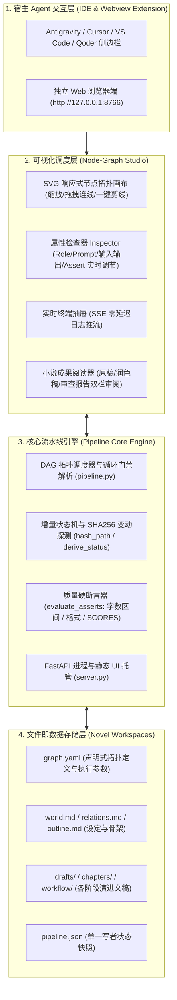
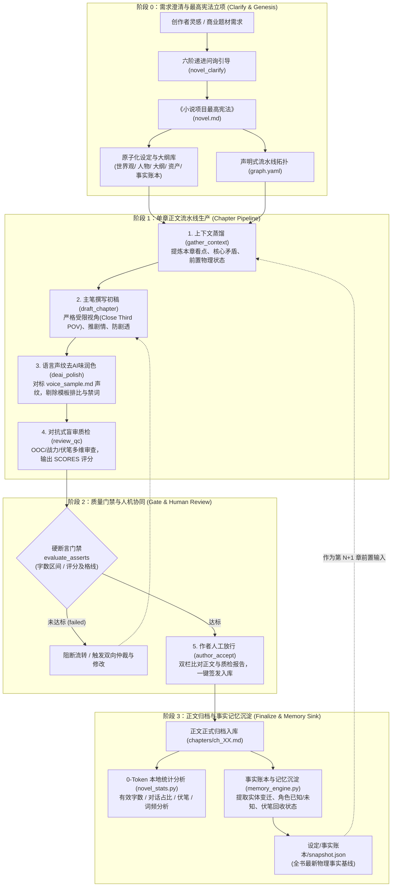
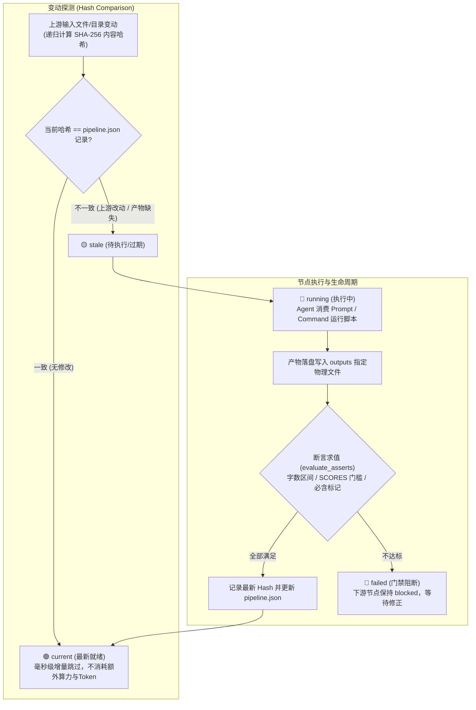
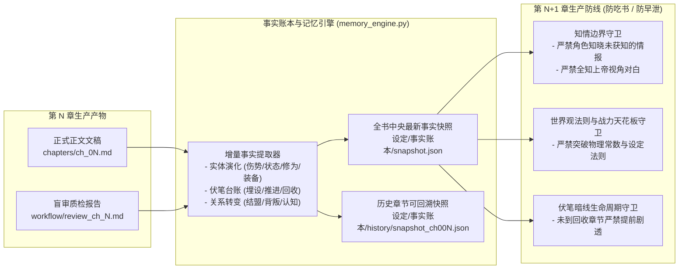
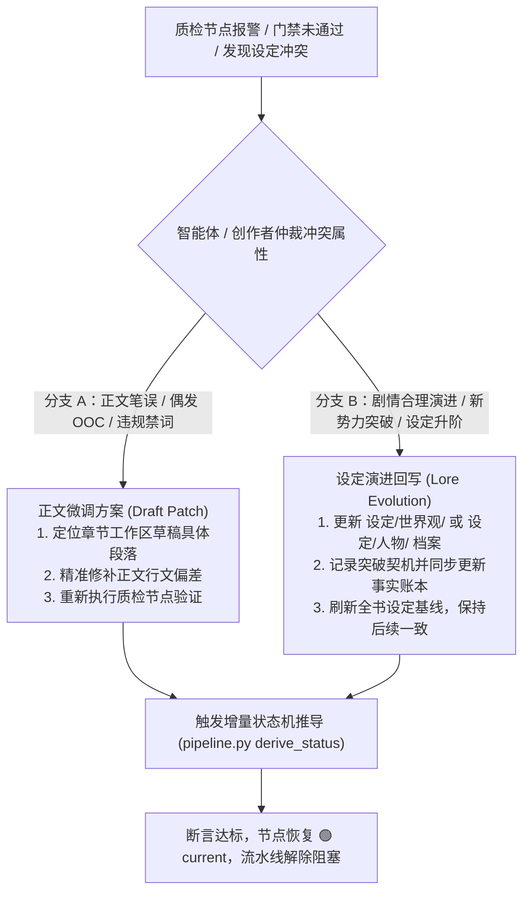

# 工业化小说生产系统技术架构白皮书
*(Open Source Novel Production Architecture & Specification Guide)*

---

## 一、 系统架构全景

本系统面向长篇连载与深度小说创作，采用分层清晰的四层架构：

---

## 二、 核心设计概念与运行机制

### 1. 三阶异构节点模型 (Three Node Kinds)
- **`agent`（大模型智能体节点）**：
  - 负责高智力创作环节（状态提炼、正文起草、去 AI 味盲审、多维审查打分）；
  - 拥有明确的角色设定（`role`）、核心指令（`prompt`）、绑定技能（`skills`）以及**质量硬断言（`assert`）**；
  - 由宿主 Agent（如 Antigravity）直接免密消费并落盘。
- **`command`（本地命令行节点）**：
  - 负责确定性本地任务（如执行 `novel_stats.py` 计算全书字数、伏笔台账提取）；
  - 0-Token 成本，100% 确定性，由本地 Python 运行时驱动。
- **`human`（人机协同关键放行闸门）**：
  - 例如正文入库、关键剧情分支选择；
  - 记录 `ackAt` 确认时间戳，只要上游输入文稿发生任何变动，审批即刻自动作废，必须重新确认。

---

### 2. 增量状态机与 SHA256 物理指纹 (Incremental Hashing)
- 系统的 `pipeline.py` 不依赖不可靠的操作系统文件修改时间（`mtime`），而是对每个节点的所有输入文件内容计算 SHA256 哈希；
- 目录按内部排序后的文件相对路径 + 各文件内容哈希复合计算；
- 当上游未变时，该节点状态为 `current`；点击“执行”时秒级跳过；
- 只有输入发生变动的节点以及受其影响的下游节点会自动变为 `stale`（过期），做到修改哪里重跑哪里。

---

### 3. 严格物理级上下文隔离 (Strict Context Isolation by Design)
- **零聊天记录共享**：节点之间绝不共享杂乱的 Chat 历史，避免超长 Token 爆炸和注意力漂移；
- **文件即唯一接口**：节点仅读取 `inputs` 中显式声明的文件，产物写入 `outputs`；
- **对抗式审查设计**：写作者与审查者角色对立，审查报告定位具体句段并输出结构化评分 `SCORES: {"overall": 85}`。

---

### 4. 质量硬断言 (Asserts Enforcement)
`pipeline.py` 在状态推导时自动对产出文件进行多维断言评估：
- `min_words` / `max_words`：中文字符数下限与上限校验；
- `min_score` / `score_field`：评分门禁，低于门槛直接判定为 `failed` 阻止流转；
- `contains_markers`：强制检查关键伏笔标记是否存在。

---

## 三、 核心运行机制流转图解

### 1. 全流程长篇小说工业化生产闭环机制

### 2. 增量 SHA-256 递归状态机流转机制

### 3. 跨章事实账本与知情边界守卫机制

### 4. 吃书冲突排查与双向仲裁决策机制

