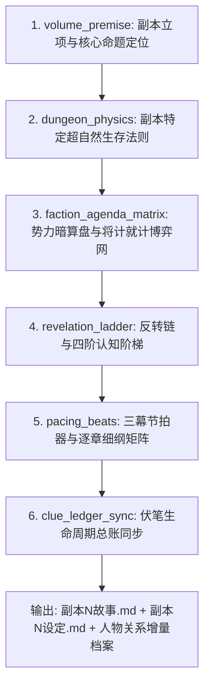

# 分卷与副本大纲立项策划工作流规范 (Volume & Dungeon Blueprint Workflow Specification)

> **版本**：v1.0  
> **适用范围**：全新分卷策划、大型副本大纲生成、跨卷主线推进  
> **核心目标**：将宏观大纲策划与微观正文流水线解耦，建立专门的“建筑师级”分卷立项架构流水线，解决长篇小说开新副本时设定散乱、阴谋扁平、伏笔丢失等结构性缺陷。

---

## 一、 为什么分卷大纲不能用单章流水线来写？

- **单章流水线（Chapter Workflow）**：是“车间螺丝钉生产”，关注微观字数、去 AI 味润色、段落节奏、盲审打分；
- **分卷/副本大纲流水线（Volume Blueprint Workflow）**：是“摩天大楼建筑蓝图”，关注宏观规则闭环、多方博弈网、几十万字的长线反转阶梯与伏笔生命周期。

如果用单章流水线去跑大纲，只会产出浮于表面的“大号剧情梗概”，缺失决定作品是否能成为神作的**深度架构骨架**。

---

## 二、 顶级分卷/副本大纲必须具备的 6 大核心维度（补充思考）

策划一个新卷/副本大纲，除基础的人物、故事情节、矛盾与转折外，必须强行注入以下 6 个核心维度：

### 1. 副本生存物理法则与胜负天花板 (Dungeon Physics & Win Condition)
- **不仅是打怪，而是独特的超自然法则解谜**：
  - **生存致死律**：进入该副本后，物理世界与现实有什么区别？什么行为会导致必定抹杀？（如兰亭副本：“改变物理世界 + 被观测 = 规则杀抹杀”）；
  - **胜负判定条件（Win Condition）**：主角团队怎样才算“通关”？生门开启的真正触发契约是什么？

### 2. 多方势力的“将计就计”与囚徒困境 (Faction Nested Scheming)
- **拒绝“主角 vs 反派”的回合制打架，构建至少 3~4 方各自独立的暗算盘**：
  - 势力 A 负责明面布局；
  - 势力 B 冷眼旁观并故意调包关键道具（如王绥之调包解药，让事态失控好趁机削弱对手）；
  - 势力 C 早已看破并预制切割证据两头下注（如桓温易容护卫，事成回荆州灭口、事败抛证据切割）；
  - 势力 D 不发一言却借刀杀人抛出弃子（如谢安借机推倒殷浩以保全皇朝颜面）。

### 3. 四阶反转链与认知递进阶梯 (Revelation Ladder)
- **反转不是灵光一现，而是认知模型的层层推翻重构**：
  - 阶梯 ①：**【表象误读】**（主角与读者以为是面具人在杀人追凶）；
  - 阶梯 ②：**【线索破损】**（发现死者是被看不见的物理规则撕碎，面具人根本看不见隐形人）；
  - 阶梯 ③：**【灾变爆发】**（以为是名士服药行散，突然暴发批量尸变）；
  - 阶梯 ④：**【势力掀桌与终极决断】**（解药是假的、生门不开、玉玺归属大博弈，顾君做出跳出算计的千古裁决）。

### 4. 伏笔生命周期双向总账 (Foreshadowing Lifecycle Ledger)
- **严格隔离短线伏笔与长线暗桩**：
  - **卷内闭环伏笔（短弧线）**：本卷埋设、本卷必定回收（例如：王绥之寒暄时的异样表情、刘弼胡人相貌的破绽）；
  - **跨卷战略暗桩（长弧线）**：本卷借机播种，严禁在当卷解释，只登记入《跨卷伏笔总账》（例如：顾君将兰亭序真迹托付给十岁的王献之、老莫看到玉玺时复杂悲凉的眼神）。

### 5. 代价守恒与不可逆创伤 (Irreversible Cost & Trauma)
- **没有代价的胜利是廉价的爽点**：
  - 本卷结束时，团队付出了什么物理与心理代价？
  - 谁留下了永久创伤？（如张洋后期成为植物人，杜子恭的牺牲）；
  - 谁的世界观产生了撕裂与成长？（如顾君对历史与民族偏见的动摇）。

### 6. 社会学潜规则与阶层语言指纹 (Sociological Authenticity)
- 时代背景不是静态风景，而是角色的潜意识枷锁：
  - 魏晋门阀名士对庶族的傲慢、清谈的行话风骨、北伐将士心中的悲怆。

---

## 三、 分卷大纲立项策划工作流 DAG 拓扑定义

### 节点规格清单：

1. **`volume_premise` (立意与终局定位官)**
   - **输入**：全书总纲、当前主线进度、已收集国宝清单。
   - **输出**：本卷核心历史舞台、核心命题、主角心智考验、终局高光抉择点。
2. **`dungeon_physics` (世界物理与法则架构师)**
   - **职责**：设计本卷的超自然规则、触发死亡的物理机制、生门开启条件。
3. **`faction_agenda_matrix` (势力算盘与阴谋精算师)**
   - **职责**：设计各方势力的表面目的、真实算盘、将计就计的交汇点。
4. **`revelation_ladder` (反转链与认知阶梯设计官)**
   - **职责**：排定 4~5 级认知反转顺序，确保读者与主角在特定章节推翻旧假设。
5. **`pacing_beats` (节拍器与逐章细纲架构师)**
   - **职责**：按照入局、修禊、流觞、现身、博弈、终局六幕，细化为每章 300~500 字的骨架细纲。
6. **`clue_ledger_sync` (伏笔总账同步与审查员)**
   - **职责**：检查本卷所有新埋伏笔是否成对、是否有跨卷冲突，输出《伏笔总表N.md》。

---

## 四、 产出标准文件规范

该工作流完成运行后，必须一次性在项目目录下输出/更新以下标准资产：
1. `副本{N}故事.md`（包含内核、规则系统、势力算盘、反转链、逐章大纲）；
2. `副本{N}设定.md`（包含副本物理学、怪物/NPC属性、生门契约）；
3. `伏笔总表{N}.md`（包含埋设章、回收章、跨卷指向）；
4. `relations.md`（增量补充当卷新出场人物的身份与称谓矩阵）。
