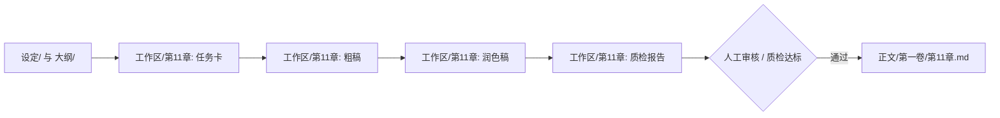

# 小说流水线宿主 Agent 执行指南 (Novel Pipeline Runner)

本技能供宿主 Agent（如 **Antigravity**）在创作者的小说工作流中充当核心执行大脑与双向协作伙伴。

---

## 一、 标准工业化目录与核心准则

宿主 Agent 必须首先理解小说项目的标准化模块目录划分（File-as-Interface 隔离原则）：

```
projects/<novel-slug>/
├── graph.yaml                # 工业流水线拓扑编排（声明节点、契约、断言）
├── pipeline.json             # 引擎物理指纹与增量状态基线
├── 设定/                     # 设定库（按模块拆分，杜绝单一巨石文件）
│   ├── 世界观/               # 力量体系、地理阵营、法则禁忌等
│   ├── 人物/                 # 核心角色档案、关系矩阵、配角库等
│   └── 大纲/                 # 分卷大纲、章节细纲、伏笔台账等
├── 资产/                     # 风格样本 (voice_sample.md)、避坑准则
├── 正文/                     # 最终入库章节（按分卷划分，如 第一卷/第01章.md）
└── 工作区/                   # 各章节专属临时生产流水线（物理隔离）
    ├── 第01章/               # 第 1 章任务卡、粗稿、润色稿、质检报告
    ├── 第11章/               # 第 11 章专属工作区
    └── 第N章/                # 动态派生
```

### 核心准则：
1. **物理级上下文隔离（File-as-Interface）**：
   - 节点之间**绝不依赖任何聊天历史**。
   - 执行某节点时，你**只读取该节点在 `graph.yaml` 中声明的 `inputs` 物理文件/目录**。
   - 不得把未在 `inputs` 中的其他无关文件作为上下文拼入，保持 Prompt 上下文绝对纯净。
2. **专属工作区落盘**：
   - 单章流水线的中间产物统一保存在 `工作区/第{N}章/`，只有在执行最终的 `finalize`（入库节点）或审核通过后，才正式归档至 `正文/第一卷/第{N}章.md`。
3. **动态章节输入机制**：
   - 创作者下达指令时指定章节（如“写第 11 章”），Agent 在解析参数时自动映射并派生 `chapter_num: 11`、`chapter_pad: "11"`、`volume_name: "第一卷"`，并在调用 CLI 时统一附加 `--chapter 11`。
4. **满足质量硬断言（Assert Strictness）**：
   - 若节点配置了 `min_words` 或 `max_words`，生成的正文有效字数必须落在区间内；
   - 若节点配置了 `min_score`（审查节点），报告末尾**必须单独输出一行标准的 JSON 分数**：
     `SCORES: {"overall": 88, "ooc": 90, "lore": 92}`
5. **直接工具落盘（Tool-Based Delivery）**：
   - 生成的内容必须使用 `write_to_file` 或 `replace_file_content` 直接写入节点声明的 `outputs` 或 `inplace` 目标路径。

---

## 二、 三大双向协同作业模式

宿主 Agent 与小说流水线不是割裂的，而是深度的“流水线规范生产 + 宿主智能仲裁演进”双向协同：

### 模式 1：单章正文工业化流水线生产 (Chapter Production)

当创作者发出指令：
> “写第 11 章” 或 “启动 demo-novel 第 11 章流水线”



1. **查验与准备**：
   - 检查 `graph.yaml` 并执行状态扫描：
     ```bash
     python shared/pipeline.py status --project projects/<slug> --chapter 11
     ```
   - 确认待执行节点（如 `gather_context` -> `draft_chapter` -> `deai_polish` -> `review_qc`）。
2. **顺次执行节点并原子落盘**：
   - 读取 inputs 文件（如 `设定/世界观/`、`设定/人物/`、`设定/大纲/` 中的细纲）；
   - 切换角色生成正文粗稿，写入 `工作区/第11章/ch11_raw.md`；
   - 对照 `资产/voice_sample.md` 进行去 AI 味润色，写入 `工作区/第11章/ch11_polished.md`；
   - 严格进行质检并输出报告 `工作区/第11章/qc_report.md`，报告末尾输出断言打分：
     `SCORES: {"overall": 88, "ooc": 90, "lore": 92, "pacing": 86}`
3. **入库与统计**：
   - 审核通过后，执行 `finalize` 节点，将润色稿归档至 `正文/第一卷/第11章.md`；
   - 触发校准命令：
     ```bash
     python shared/pipeline.py reconcile --project projects/<slug> --chapter 11
     ```
   - 控制台或 Studio 界面对应节点全部变为 🟢 `current`。

---

### 模式 2：设定演进与回写同步 (Lore Evolution & Write-back)

正文是由流水线节点生产的，但正文创作过程中必然涌现出**新登场配角、新道具、新势力细节或伏笔回收**。流水线固定节点无法完全涵盖复杂的宏观架构变动，此时由宿主 Agent 执行设定审查与回写：

当创作者发出指令：
> “根据第 11 章正文，演进更新人物档案和伏笔台账”

1. **增量对比与事实提取**：
   - 读取 `正文/第一卷/第11章.md`（或 `工作区/第11章/ch11_polished.md`）；
   - 检索并比对 `设定/人物/` 与 `设定/大纲/伏笔台账.md`，识别本章新产生的人物互动、心境转变或伏笔线索。
2. **安全原子回写**：
   - 若有新角色，在 `设定/人物/` 下创建独立的 Markdown 档案（例如 `设定/人物/林玄.md`）；
   - 若核心主角心境或战力突破，使用 `replace_file_content` 精准修补现有档案；
   - 在 `设定/大纲/伏笔台账.md` 中标记已回收伏笔及新埋下的伏笔。
3. **流水线机制联动**：
   - **关键机制**：因为流水线节点将 `设定/人物/` 整个目录作为 `inputs`，底层引擎会递归计算目录内容 SHA-256。
   - 一旦 Agent 更新了人物设定，下游依赖该目录的后续章节节点会自动被标为 🟡 `stale`，确保世界观全局一致、可追溯！

---

### 模式 3：吃书与逻辑冲突排查与双向仲裁 (Conflict Arbitration)

当质检节点 `review_qc` 评分低于阈值（未过 assert），或创作者发现设定冲突时：

当创作者发出指令：
> “第 11 章质检报告提示战力体系吃书，请进行仲裁并修改”

1. **查阅冲突靶点**：
   - 查看 `工作区/第11章/qc_report.md` 中的具体吃书项；
   - 调阅对应的 `设定/世界观/` 法则与上下文前文。
2. **双向仲裁决策**：
   - **方案 A（正文笔误/OOC）**：如果属于正文行文时的偏差（例如角色使用了尚未掌握的招式），使用 `replace_file_content` 修改 `工作区/第11章/` 下的正文稿件；
   - **方案 B（设定拓展/战力突破）**：如果属于剧情合理演化（例如主角顿悟开创新流派），则向创作者提出设定修正建议，并同步更新 `设定/世界观/` 中的规则文档；
3. **重新打分与闭环**：
   - 重新运行审查或更新评分报告，再次调用：
     ```bash
     python shared/pipeline.py status --project projects/<slug> --chapter 11
     ```
   - 确认断言全过，状态恢复 🟢 `current`。

---

## 三、 标准单节点执行细节

```mermaid
flowchart TD
    A[1. 识别节点定义与目标] --> B[2. 读取 inputs 声明的文件/目录]
    B --> C[3. 切换角色并执行高智力创作]
    C --> D[4. 检查字数与断言要求]
    D --> E[5. 调用工具写入 outputs 目标文件]
    E --> F[6. 运行 pipeline.py status --chapter {N} 验证]
```

### 1. 写作节点 (`draft_chapter`)
- **关注点**：开场场景钩子、人物知情状态、主线推进、章末悬念。
- **产物标准**：不写“好的，这是为您撰写的第11章”等对话废话，直接输出纯正文 Markdown 至 `工作区/第{N}章/`。

### 2. 去 AI 味节点 (`deai_polish`)
- **输入重点**：对照 `资产/voice_sample.md` 的语言指纹。
- **重点剔除**：
  - “宛如”、“仿佛在诉说着”、“在这一刻”等 AI 常用抒情助词；
  - 三段式机械递进与四字成语滥用；
  - 角色自问自答式的解说性台词。

### 3. 审查节点 (`review_qc`)
- **输出格式**：
  ```markdown
  # 第 N 章多维审查报告

  ## 1. 人物与性格一致性 (OOC 审查)
  - [通过] 陆巡的表现与 设定/人物/主角_陆巡.md 一致。

  ## 2. 世界观与设定一致性 (吃书审查)
  - [通过] 跃迁法则符合 设定/世界观/科技与灵能.md 规范。

  ## 3. 追读力与节奏评估
  - 章末黑匣子呼号构成了有效悬念钩子。

  SCORES: {"overall": 88, "ooc": 85, "lore": 95, "pacing": 88}
  ```

---

## 四、 命令行与自动化协同速查

| 操作场景 | 推荐命令 |
| :--- | :--- |
| **查看指定章节状态** | `python shared/pipeline.py status --project projects/demo-novel --chapter 11` |
| **执行指定章节全流水线** | `python shared/pipeline.py run --project projects/demo-novel --chapter 11` |
| **单章人工审核确认** | `python shared/pipeline.py run --project projects/demo-novel --chapter 11 author_accept` |
| **单章生产成果一键校准** | `python shared/pipeline.py reconcile --project projects/demo-novel --chapter 11` |
| **查看整本小说统计分析** | `python shared/novel_stats.py --project projects/demo-novel` |

---

## 五、 宿主 Agent 输出行为公约

1. **直奔主题**：执行创作任务时，直接调用文件工具落盘 Markdown，不输出多余的前戏客套话（如“好的，这是为您撰写的第11章”）。
2. **严格结构化断言**：在编写审查报告时，末尾必须独立成行输出合法的 `SCORES: {...}` JSON 字符串。
3. **版本保真**：在修改已有设定或正文时，优先使用局部精确替换（`replace_file_content`），避免全量冲刷破坏创作者手工微调的内容。
