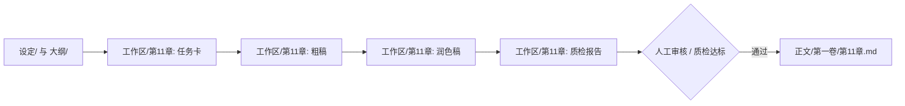
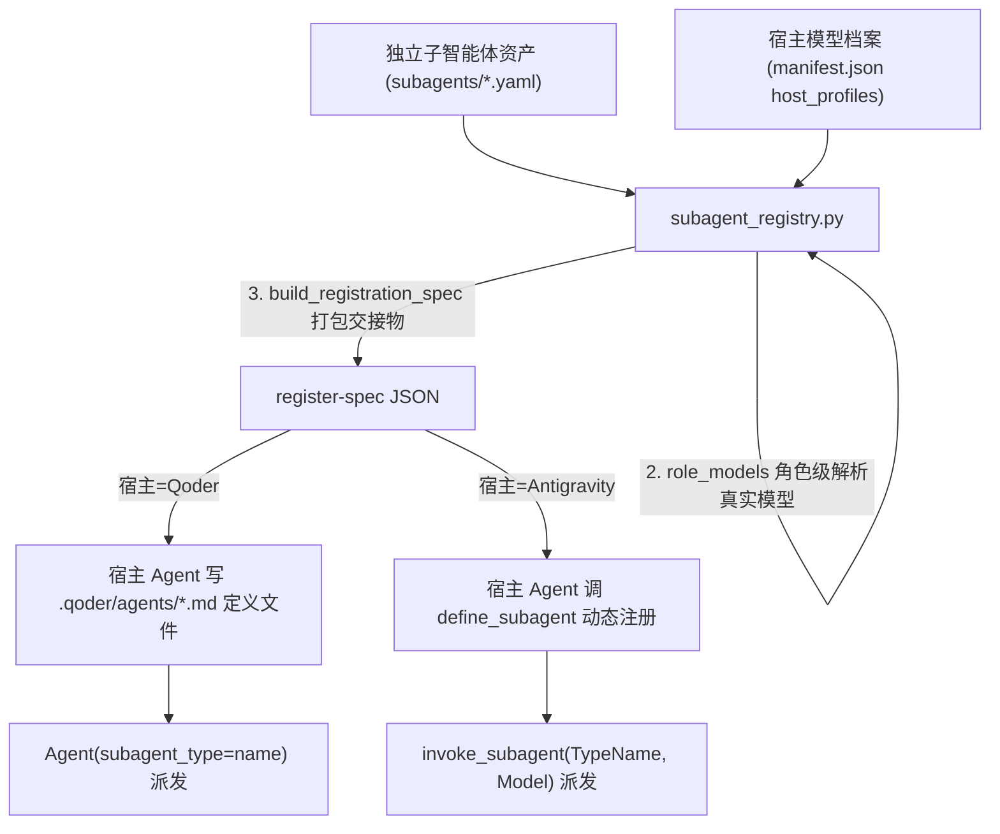

# 小说流水线宿主 Agent 执行指南 (Novel Pipeline Runner)

本技能供宿主 Agent（如 **Antigravity**）在创作者的小说工作流中充当核心执行大脑与双向协作伙伴。

---

## 一、 标准工业化目录与核心准则

宿主 Agent 必须首先理解小说项目的标准化模块目录划分（File-as-Interface 隔离原则）：

```
projects/<novel-slug>/
├── graph.yaml                # 工业流水线拓扑编排（声明节点、契约、断言）
├── pipeline.json             # 引擎物理指纹与增量状态基线
├── 设定/                     # 设定库（按模块拆分，杜绝单一巨石文件）
│   ├── 世界观/               # 力量体系、地理阵营、法则禁忌等
│   ├── 人物/                 # 核心角色档案、关系矩阵、配角库等
│   └── 大纲/                 # 分卷大纲、章节细纲、伏笔台账等
├── 资产/                     # 风格样本 (voice_sample.md)、避坑准则
├── 正文/                     # 最终入库章节（按分卷划分，如 第一卷/第01章.md）
└── 工作区/                   # 各章节专属临时生产流水线（物理隔离）
    ├── 第01章/               # 第 1 章任务卡、粗稿、润色稿、质检报告
    ├── 第11章/               # 第 11 章专属工作区
    └── 第N章/                # 动态派生
```

### 核心准则：
1. **物理级上下文隔离（File-as-Interface）**：
   - 节点之间**绝不依赖任何聊天历史**。
   - 执行某节点时，你**只读取该节点在 `graph.yaml` 中声明的 `inputs` 物理文件/目录**。
   - 不得把未在 `inputs` 中的其他无关文件作为上下文拼入，保持 Prompt 上下文绝对纯净。
2. **专属工作区落盘**：
   - 单章流水线的中间产物统一保存在 `工作区/第{N}章/`，只有在执行最终的 `finalize`（入库节点）或审核通过后，才正式归档至 `正文/第一卷/第{N}章.md`。
3. **动态章节输入机制**：
   - 创作者下达指令时指定章节（如“写第 11 章”），Agent 在解析参数时自动映射并派生 `chapter_num: 11`、`chapter_pad: "11"`、`volume_name: "第一卷"`，并在调用 CLI 时统一附加 `--chapter 11`。
4. **满足质量硬断言（Assert Strictness）**：
   - 若节点配置了 `min_words` 或 `max_words`，生成的正文有效字数必须落在区间内；
   - 若节点配置了 `min_score`（审查节点），报告末尾**必须单独输出一行标准的 JSON 分数**：
     `SCORES: {"overall": 88, "ooc": 90, "lore": 92}`
5. **直接工具落盘（Tool-Based Delivery）**：
   - 生成的内容必须使用 `write_to_file` 或 `replace_file_content` 直接写入节点声明的 `outputs` 或 `inplace` 目标路径。

---

## 二、 四大双向协同作业模式

宿主 Agent 与小说流水线不是割裂的，而是深度的“流水线规范生产 + 宿主智能仲裁演进”双向协同：

### 模式 0：需求澄清与最高宪法立项 (Constitution Genesis)

当创作者启动一本新书、或将已有旧稿接入流水线提效时：
> “我想写一本新小说” 或 “帮我把这个脑洞立项建立流水线”

1. **六阶递进问询引导**：
   - 宿主 Agent 必须主动按六阶逻辑依次提问澄清（切忌一次性堆砌几十个问题）：
     - **阶梯一（商业定位）**：书名、题材、目标平台（番茄/起点）、一句话核心爽点/金手指；
     - **阶梯二（世界法则）**：与现实关联度、力量/科技层级、3 条绝对不可违背的法则铁律与终极代价；
     - **阶梯三（人物灵魂）**：主角表面身份、隐藏底牌、核心执念、性格缺陷、反派自洽逻辑、知情边界；
     - **阶梯四（三幕与暗线）**：全书三幕走向、首卷破局目标、1~2 个【严禁前期剧透】的深层暗线；
     - **阶梯五（叙事声纹与语言风格定制）**：
       - **【强制必问】**：明确指定全书核心文风/语言风格原型，严禁模糊带过！默认首推 **《十日终焉》×《诡舍》原型**（纯现代通俗白话占比 90%~95%、高智商推演齿轮咬合、生理恐惧与紧绷心理流、半文半白仅占 5%~10% 适度穿插），亦可选《鬼吹灯》探险风、都市冷硬风或自定义；
       - 明确白话与文言配比（严防流水线生成枯燥艰涩的大段半文半白）；
       - 明确心理与情绪深度（必须包含瞳孔、心率、冷汗等生理恐惧应激与主角高速推演思维，严禁情感空心化）；
       - 明确抗朱雀一票否决禁词表（“宛如”、“仿佛在诉说着”、“在这一刻”等）；
     - **阶梯六（工程参数）**：单章字数区间（如 2500~4500）、质检及格门槛（SCORES >= 80）。
2. **订立最高宪法与文风全生命周期持久化**：
   - 将确认后的信息（包含确立的文风原型与配比）编译生成全书不可逾越的顶层法典 `novel.md`（特别是第四条：叙事声纹与抗朱雀检测规范）；
   - 自动调用 `shared/novel_clarify.py` 或直接工具分发落盘至 `设定/世界观/`、`设定/人物/`、`设定/大纲/`、`设定/事实账本/snapshot.json`（持久化 `style_constitution`）、`资产/voice_sample.md`（写入《十日终焉》×《诡舍》黄金样本）以及生成 `graph.yaml`（各节点注入通俗白话与心理推演提示词断言）。

---

### 模式 1：单章正文工业化流水线生产 (Chapter Production)

当创作者发出指令：
> “写第 11 章” 或 “启动 demo-novel 第 11 章流水线”



1. **查验与准备**：
   - 检查 `graph.yaml` 并执行状态扫描：
     ```bash
     python shared/pipeline.py status --project projects/<slug> --chapter 11
     ```
   - 确认待执行节点（如 `gather_context` -> `draft_chapter` -> `deai_polish` -> `review_qc`）。
2. **顺次执行节点并原子落盘**：
   - **执行前点亮 WebUI 运行态**：在调度 Subagent 开始执行节点前，执行：
     ```bash
     python shared/pipeline.py start <node_id> --project projects/<slug> --chapter {N}
     ```
     （此命令会瞬间在 WebUI 画布上点亮该节点的赛博青蓝呼吸脉冲与动态旋转 Spinner，让创作者即时感知当前哪个节点正在运行！）
   - 读取 inputs 文件（如 `设定/世界观/`、`设定/人物/`、`设定/大纲/` 中的细纲）；
   - 切换角色或调用 Subagent 生成对应产物并原子写入 `outputs` 路径；
   - 严格进行质检断言并输出符合规范的 Markdown 产物；
   - **执行后自动结项**：运行 `python shared/pipeline.py status --project projects/<slug> --chapter {N}`，引擎自动校验产物并清除运行态，节点卡片即刻变为 🟢 `current`。
3. **入库与统计**：
   - 审核通过后，执行 `finalize` 节点，将润色稿归档至 `正文/第一卷/第11章.md`；
   - 触发校准命令：
     ```bash
     python shared/pipeline.py reconcile --project projects/<slug> --chapter 11
     ```
   - 控制台或 Studio 界面对应节点全部变为 🟢 `current`。

---

### 模式 2：设定演进与回写同步 (Lore Evolution & Write-back)

正文是由流水线节点生产的，但正文创作过程中必然涌现出**新登场配角、新道具、新势力细节或伏笔回收**。流水线固定节点无法完全涵盖复杂的宏观架构变动，此时由宿主 Agent 执行设定审查与回写：

当创作者发出指令：
> “根据第 11 章正文，演进更新人物档案和伏笔台账”

1. **增量对比与事实提取**：
   - 读取 `正文/第一卷/第11章.md`（或 `工作区/第11章/ch11_polished.md`）；
   - 检索并比对 `设定/人物/` 与 `设定/大纲/伏笔台账.md`，识别本章新产生的人物互动、心境转变或伏笔线索。
2. **安全原子回写**：
   - 若有新角色，在 `设定/人物/` 下创建独立的 Markdown 档案（例如 `设定/人物/林玄.md`）；
   - 若核心主角心境或战力突破，使用 `replace_file_content` 精准修补现有档案；
   - 在 `设定/大纲/伏笔台账.md` 中标记已回收伏笔及新埋下的伏笔。
3. **流水线机制联动**：
   - **关键机制**：因为流水线节点将 `设定/人物/` 整个目录作为 `inputs`，底层引擎会递归计算目录内容 SHA-256。
   - 一旦 Agent 更新了人物设定，下游依赖该目录的后续章节节点会自动被标为 🟡 `stale`，确保世界观全局一致、可追溯！

---

### 模式 3：吃书与逻辑冲突排查与双向仲裁 (Conflict Arbitration)

当质检节点 `review_qc` 评分低于阈值（未过 assert），或创作者发现设定冲突时：

当创作者发出指令：
> “第 11 章质检报告提示战力体系吃书，请进行仲裁并修改”

1. **查阅冲突靶点**：
   - 查看 `工作区/第11章/qc_report.md` 中的具体吃书项；
   - 调阅对应的 `设定/世界观/` 法则与上下文前文。
2. **双向仲裁决策**：
   - **方案 A（正文笔误/OOC）**：如果属于正文行文时的偏差（例如角色使用了尚未掌握的招式），使用 `replace_file_content` 修改 `工作区/第11章/` 下的正文稿件；
   - **方案 B（设定拓展/战力突破）**：如果属于剧情合理演化（例如主角顿悟开创新流派），则向创作者提出设定修正建议，并同步更新 `设定/世界观/` 中的规则文档；
3. **重新打分与闭环**：
   - 重新运行审查或更新评分报告，再次调用：
     ```bash
     python shared/pipeline.py status --project projects/<slug> --chapter 11
     ```
   - 确认断言全过，状态恢复 🟢 `current`。

---

### 模式 4：宿主感知的子智能体注册与模型自适应挂载 (Host-Aware Subagent Registration & Dynamic Mounting)

当创作者在某个 Agent 宿主（如 **Qoder**、**Antigravity**）中首次接手项目，或需要更新算力模型绑定时：
> “把小说工作流的核心节点封装注册进宿主 Agent，并配置各节点模型”

**核心原则（务必遵守）**：注册动作由 **宿主 Agent 自己完成**，而不是由本仓库代码完成——因为不同宿主注册子智能体的方式完全不同。本仓库的 `subagent_registry.py` 只做三件事：**感知宿主 → 解析每个角色在该宿主下真实可用的模型 → 打包出一份注册交接物（register-spec）**。宿主 Agent 拿到交接物后，按自己宿主的契约去注册。



1. **查验独立规格资产库 (`subagents/`)**：
   - 七大专家独立定义（5 核心 + 2 扩展）：
     - `novel_context_scout` (`context_scout.yaml`): 前情探索与状态对齐总账员（默认 `flash`）
     - `novel_chapter_writer` (`chapter_writer.yaml`): 长篇小说主笔作家（默认 `flash`）
     - `novel_deai_polisher` (`deai_polisher.yaml`): 去AI味与文风校准专家（默认 `flash`）
     - `novel_persona_auditor` (`persona_auditor.yaml`): 角色人设与行为边界稽查官（默认 `flash`）
     - `novel_qc_reviewer` (`qc_reviewer.yaml`): 历史考据主编与反吃书盲审员（默认 `pro`）
     - `novel_dungeon_architect` (`dungeon_architect.yaml`): 副本/秘境物理规则架构师（默认 `pro`）
     - `novel_faction_schemer` (`faction_schemer.yaml`): 门派/势力权谋议程编排师（默认 `pro`）
   - 注意：yaml 规格里**不再写任何具体模型名**，只有 `default_tier`（flash/pro）这个跨宿主抽象。具体模型只存在于各宿主的 `host_profiles.<host>` 里，彼此对等——antigravity 用 gemini/claude，qoder 用内置 ID，没有哪个宿主是"出厂默认"。某角色在某宿主下用哪个模型，完全由第 2 步的角色级档案（`role_models`）决定。
2. **感知宿主 + 角色级模型解析（代码负责）**：
   - 交互式档位方案仍供创作者选取（决定每个角色的 `tier`）：
     - **方案 A（黄金推荐配置）**：前情/起草/润色/人设 = `flash`，盲审/副本/权谋 = `pro`
     - **方案 B（全速省额度配置）**：全节点 `flash`
     - **方案 C（全 Pro 极致深度配置）**：全节点 `pro`
     - **方案 D（自定义逐节点指定）**：逐一指定各节点档位
   - 持久化写入绑定（tier 层面）：
     ```bash
     python shared/subagent_registry.py configure --project <novel-dir> --preset recommended
     ```
   - **宿主模型档案在 `subagents/manifest.json` 的 `host_profiles` 里提前写死，用户/宿主 Agent 可编辑**。其中 `qoder.role_models` 是 7 个角色 → Qoder 真实内置模型 ID 的映射（`flash` 档 → `qfmodel`，`pro` 档 → `qmodel_38max`）。
     - ⚠ **Qoder 只认内置系统 ID（`qfmodel`/`qmodel_38max`/`gfmodel`/`gmodel`/…）与 BYOK 裸 UUID**；`gemini-*`、`claude-*`、`kimi-k3` 这类上游 slug 会被 **静默回落**到当前会话模型（2026-09-22 已实测复现）。所以角色级绑定必须填内置 ID，不能填 slug。
   - 打包注册交接物（这一步只感知与解析，不注册）：
     ```bash
     python shared/subagent_registry.py register-spec --project <novel-dir> --host qoder
     ```
     输出的 JSON 含 `host`、`registration`（该宿主的注册契约）、`subagents[]`（每项带 `_bound_model` = 已解析成宿主真实模型 ID、`_model_origin` = `role-mapped`、`system_prompt` 等）。
3. **宿主 Agent 自行注册（宿主负责，非代码）**：
   - **宿主 = Qoder**：宿主 Agent 按 `registration` 契约（`mechanism: host-agent-writes-definition-files`）为每个角色写一个定义文件 `<project>/.qoder/agents/<name>.md`：
     - frontmatter 字段：`name`、`description`、`model`（填 `_bound_model`，即内置 ID 或 BYOK 裸 UUID）、`tools`；
     - 正文 = 该角色 yaml 的 `system_prompt` 原文；
     - ⚠ **Qoder 不支持按调用覆盖模型**，模型只由定义文件 frontmatter 的 `model` 决定；
     - ⚠ **新增或改名的 agent 类型必须新开会话才会被 Qoder 注册上**（`requires_new_session: true`）。
   - **宿主 = Antigravity**：宿主 Agent 按契约（`mechanism: host-tool-define-subagent`）读取 `subagents[]`，依次调用自身的 `define_subagent` 工具注册；模型同样来自 `host_profiles.antigravity.role_models`（gemini/claude），与 qoder 对等；Antigravity 还支持按调用传档位（`per_call_model_override: true`）。
4. **运行时精准调度**：
   - **Qoder**：用 `Agent(subagent_type=novel_qc_reviewer)` 派发；模型已在定义文件里锁定，无需（也无法）在调用处再指定。
   - **Antigravity**：作为 Supervisor 用 `invoke_subagent(TypeName, Role, Model, Prompt)` 派发，并显式传入用户配置的 `Model` 档位。
5. **验证真实路由（务必做）**：
   - 不要凭定义文件内容推断实际生效模型。派发一个真实探针后，核对 `~/.qoder/projects/<项目slug>/<会话id>/subagents/task-*.json` 的 `resolvedModel` 字段，以及结构化事件里的 `provider`/`request_id`，确认落到了预期的内置模型而非静默回落。

---

## 三、 标准单节点执行细节

```mermaid
flowchart TD
    A[1. 识别节点定义与目标] --> B[2. 读取 inputs 声明的文件/目录]
    B --> C[3. 调度 Subagent 执行高智力创作/审查]
    C --> D[4. 检查人设知情边界与字数/断言要求]
    D --> E[5. 调用工具写入 outputs 目标文件]
    E --> F[6. 运行 pipeline.py status --chapter {N} 验证]
```

### 1. 写作节点 (`draft_chapter`)
- **关注点**：开场场景钩子、人物知情状态、主线推进、章末悬念。
- **对白呼吸感准则**：严禁连续 450 字无互动的冗长说明文，但绝不可机械式频繁插入无营养碎嘴对白；全篇对白占比控制在 25%~40% 黄金区间，留足 60%+ 篇幅给主要人物的深度心理推演、微表情与战术动作白描。
- **人设言行铁律**：老莫是隐藏大佬（胸有成竹、话少而精，绝不可表现为小白式疑惑）；秦华是自治区干部与战术行动派（执行力极强、专注布防掩护，绝不发表大段古代汉族历史与门阀考据）。

### 2. 去 AI 味节点 (`deai_polish`)
- **输入重点**：对照 `资产/voice_sample.md` 的语言指纹。
- **重点剔除**：
  - “宛如”、“仿佛在诉说着”、“在这一刻”等 AI 常用抒情助词；
  - 整合碎嘴对白，提炼主要角色的微反应与内心博弈。

### 3. 人设稽查节点 (`audit_persona`)
- **专职职责**：排查主要角色 OOC、说话指纹错乱、知情边界越界，重点盯防老莫言行与秦华历史知识边界，输出 `03_5_人设审查报告.md`。

### 4. 盲审质检节点 (`review_qc`)
- **输出格式**：
  ```markdown
  # 第 N 章多维审查报告

  ## 1. 人物与性格一致性 (OOC 审查)
  - [通过] 陆巡的表现与 设定/人物/主角_陆巡.md 一致。

  ## 2. 世界观与设定一致性 (吃书审查)
  - [通过] 跃迁法则符合 设定/世界观/科技与灵能.md 规范。

  ## 3. 追读力与节奏评估
  - 章末黑匣子呼号构成了有效悬念钩子。

---

## 四、 节点专业技能字典与激活规范 (Skill Arsenal)

当节点声明了 `skills: [...]` 时，宿主 Agent **必须调取对应专业技能的核心准则**指导生成或质检：

| 技能类别 | 技能 ID | 核心准则与执行要点 |
| :--- | :--- | :--- |
| **风格写作** | `novel-style-narrator` | 严格采用受限第三人称视角 (Close Third Person)，控制叙事距离，禁止乱跳全知视点或说教 |
| | `novel-scene-pacing` | 场景三要素闭环（即时目标-阻碍交锋-恶化转折），动静交替，每场景推进一寸主线 |
| | `novel-style-fanqie-xuanhuan` | 番茄高爽脑洞流：短单句快节奏、即时金手指反馈、围观震惊流（反差感打脸）、绝不虐主 |
| | `story-combat-face` | **[开源 6.8k⭐]** 网文装逼打脸与爽点释放：震惊传递链、情绪调动、该爽不爽比毒点还毒（番茄高爽标杆） |
| | `story-suspense-investigation` | **[开源 6.8k⭐]** 长篇悬疑惊悚与反转设计：多线悬念周期（短/中/长弧）、三段式钩子（种-养-扣）（起点悬疑标杆） |
| **去除AI味** | `novel-deai-humanizer` | 极致去 AI 味军规：消灭假大空抒情，严格白描，短句破进，语言指纹对齐 |
| | `novel-sensory-grounding` | 五感具象白描与具身化认知：用微表情、触感温度、气味声响与生理应激代替形容词 |
| | `novel-anti-cliche` | 禁词库绝杀：粉碎“宛如/仿佛/在这一刻/嘴角勾起一抹/倒吸一口凉气”与三连排比说明句 |
| | `story-deslop` | **[开源 6.8k⭐]** 网文去 AI 味与禁词库：检测并清除模板化书面腔，内置 `banned-words.md` 与改写门禁 |
| **开篇与伏笔** | `novel-opening-hook` | 黄金开篇“三秒法则”危机切入；章末强制采用六大悬念钩子模型断章（反转/倒计时/未知信息等） |
| | `novel-clue-foreshadowing` | 草蛇灰线四阶段（播种-发酵-锁紧-回收），严防机械降神，破局工具必须前置登场 |
| | `novel-plot-architect` | 经典三幕弧光与节拍器（危机升级、中点反转、至暗时刻、逆转高潮与情绪价值释放） |
| **抗遗忘因果引擎** | `novel-memory-ledger` | **[核心引擎]** 15 维事实快照 (Fact Snapshot) 与 12 类变更声明 (CHANGES) 回写，5 重因果守卫门禁，支撑 3000 章跨度抗遗忘 |
| **上下文管理** | `novel-context-curator` | 极度严苛的上下文剪刀手：剔除 90% 不相关设定，提炼 1000 字纯净任务卡，阻绝幻觉 |
| | `novel-character-guardian` | 人物声音指纹与知情边界三问：他此时在哪里？谁告诉他的？动机是什么？严防 OOC |
| | `novel-memory-sink` | 事实总账增量提取、人物动态状态快照与伏笔台账生命周期维护 |
| **章节审核** | `novel-lore-enforcer` | 世界观底层法则负向核验：铁律圣经一票否决，通讯时空与代价守恒对抗性排查 |
| | `novel-consistency-auditor` | 跨章节物理连续性审计：伤势未愈、物品归属、时空移动时速与物理常识防穿帮 |
| | `novel-pacing-evaluator` | 商业追读力与水分评估：测算水分压缩比，输出标准 `SCORES: {...}` 结构化门禁打分 |
| | `story-review` | **[开源 6.8k⭐]** 多视角对抗式长篇审查：执行严厉的结构/角色/文字/设定对抗式核查（找问题而非验证正确性） |

---

## 五、 命令行与自动化协同速查

| 操作场景 | 推荐命令 |
| :--- | :--- |
| **查看指定章节状态** | `python shared/pipeline.py status --project projects/demo-novel --chapter 11` |
| **执行指定章节全流水线** | `python shared/pipeline.py run --project projects/demo-novel --chapter 11` |
| **单章人工审核确认** | `python shared/pipeline.py run --project projects/demo-novel --chapter 11 author_accept` |
| **单章生产成果一键校准** | `python shared/pipeline.py reconcile --project projects/demo-novel --chapter 11` |
| **查看整本小说统计分析** | `python shared/novel_stats.py --project projects/demo-novel` |

---

## 五、 宿主 Agent 输出行为公约

1. **直奔主题**：执行创作任务时，直接调用文件工具落盘 Markdown，不输出多余的前戏客套话（如“好的，这是为您撰写的第11章”）。
2. **严格结构化断言**：在编写审查报告时，末尾必须独立成行输出合法的 `SCORES: {...}` JSON 字符串。
3. **版本保真**：在修改已有设定或正文时，优先使用局部精确替换（`replace_file_content`），避免全量冲刷破坏创作者手工微调的内容。
